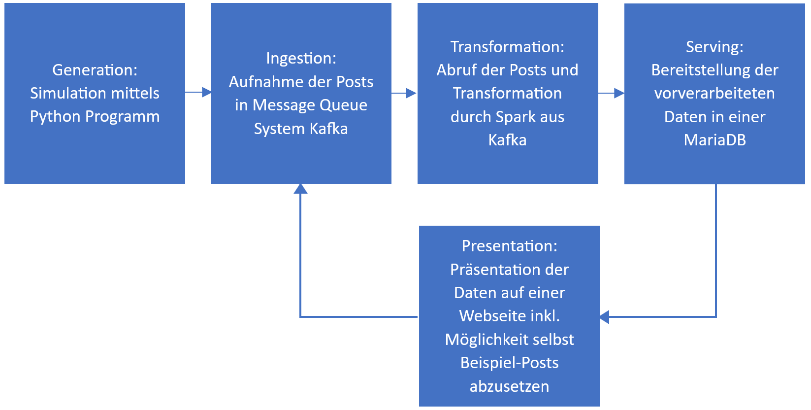

# 1. Use Case Beschreibung

## 1.1 Beschreibung

Unser ausgewählter Use Case bezieht sich auf die Auswertung von Social Media Posts auf der ehemaligen Plattform Twitter. Die Auswertung umfasst die Verarbeitung simulierter abgesetzter Posts und das Aggregieren der enthaltenen Hashtags, um die Verwendung dieser bezogen auf einen Zeitraum auswerten zu können. Somit kann z.B. eine Übersicht über die am meisten Verwendeten Hashtags erstellt werden. Dies soll in vom uns gewählten Szenario auch für historische Daten möglich sein. Dadurch kann z.B. zurückverfolgt werden, an welchem Tag in der Vergangenheit welche Hashtags in den Trends waren. Als kleine Beispieldatei zusätzlich zu eigenständig absetzbaren Posts wird folgender, öffentlich zugängliche Datensatz verwendet:
https://www.kaggle.com/datasets/kazanova/sentiment140/data

## 1.2 Laborarbeit

Die Laborarbeit inklusive auch dieses Word-Dokuments noch einmal finden Sie in unserem öffentlichen Git-Repository unter:
nikosauter/bde_backend: Big Data Engineering Backend Lab Work (github.com)
Das gesamte System wird mit Hilfe von Skaffold entwickelt. Um alle Komponenten zu starten ist deshalb nur ein Skaffold-Befehl nötig. Die Skaffold-Yaml ist im Oberverzeichnis zu finden. Darunter ist ein Order „k8s“, in dem sich die Yaml-Dateien für die Kubernetes-Pods befinden. Ergänzend zu manchen Pods sind Dockerfiles, Programme und Dateien in entsprechend weiteren Ordnern zu finden.
Zum Ausführen sind folgende Befehle nötig:

Vorbedingungen:

- Docker ist gestartet
- Minikube ist gestartet
  - Minikube start -> für bestehenden Container
  - Minikube start –addons=ingress –memory 7000 –cpus 6 -> für neuen Container

Start:

- Navigieren in das Verzeichnis der Laborarbeit, in der die Skaffold.yaml-Datei liegt
- skaffold dev
- minikube tunnel (in einer neuen Shell)
- http://localhost/trending in einem Browser aufrufen
  Eine Bildschirmaufnahme dieses Prozesses finden Sie in der Screencast_Use_Case.gif-Datei, welche sich ebenfalls im Git-Repository befindet.

# 2. Aufbau

Dieses Kapitel beginnt mit einer Beschreibung der Architektur. Die Unterkapitel gehen daraufhin auf die einzelnen Bestandteile ein. Die Architektur orientiert sich am Big Data Engineering Lifecycle:

## 2.1 Generation

In unserem Beispiel wird die Datengenerierung simuliert. Ein Python-Programm schreibt vorgegebene Posts aus einer Textdatei nach kleiner Umwandlung in einem JSON-Format periodisch in den Ingestion Layer. Dieses Programm und die Beispieldaten befinden sich in einem eigenen Docker-Container. Die Dateien hierfür sind im Ordner „publisher“ und die Yaml im k8s-Ordner unter dem gleichen Namen zu finden. Bei den Beispieldaten wird der anfangs erwähnte Beispieldatensatz verwendet. Wir haben jedoch für eine bessere Beispielauswertung Posts herausgefiltert, welche keine Hashtags beinhalten.
Das simulierte Quellsystem pusht die Daten zu Big Data Analyse Systemen. Dieses Vorgehen ist besonders geeignet für Real-Time-Anforderungen, wie es unser Use Case verlangt.
Die Daten in Kafka, die Logs zu den Posts, haben folgendes JSON-Format (In den Klammern steht der JSON-Key):
| ID (id) | Datum (timestamp) | User (username) | Post-Text (text) |
|---------|-------------------|-----------------|------------------|

## 2.2 Ingestion

Die Umsetzung des Ingestion-Layers in unserer Kappa-Architektur basiert auf der Verwendung von Apache Kafka in Verbindung mit Apache ZooKeeper in einem Kubernetes-Cluster. Apache Kafka fungiert als Big Data Message Queue System und ermöglicht die Aufnahme von Daten in nahezu Echtzeit, wodurch eine effiziente Weiterverarbeitung gewährleistet wird. Diese Geschwindigkeit erfüllt unsere Anforderungen an den Use Case, und je nach genauer Konfiguration stehen uns bedingt historische Daten zur Verfügung.

Die Verwendung von Kafka in Verbindung mit ZooKeeper ermöglicht die Entkopplung von Erzeugern und Abnehmern, wobei Kafka mit mehreren Replikas für eine robuste Datenverfügbarkeit definiert ist. Das Follower-Leader-Prinzip in ZooKeeper gewährleistet eine zuverlässige Koordination zwischen den Kafka-Knoten.
Durch die Integration eines Zeitstempels in den Daten selbst ermöglicht uns Kafka, mit Event-Zeiten zu arbeiten. Die partitionsübergreifende Beibehaltung der Reihenfolge ist dank des Zeitstempels in den Daten selbst kein Problem. Diese Struktur unterstützt eine präzise und zeitabhängige Auswertung der Daten.
Des Weiteren bietet Kafka in Kombination mit ZooKeeper eine zuverlässige Grundlage für den Datenfluss in unserer Kappa-Architektur, wobei die Flexibilität von Kafka und die Konsistenz von ZooKeeper für eine optimale Datenverarbeitung sorgen. In unserem Use Case haben wir ZooKeeper als Headless-Service definiert, sodass die einzelnen ZooKeeper-Knoten direkt miteinander kommunizieren können. Dies hat den großen Vorteil, dass die interne Kommunikation effizient und ohne Umwege erfolgt.

## 2.3 Stream Processing Layer

Als Trigger für unsere Microbatches wählen wir ein festes Intervall. Es werden die Zwischenergebnisse der einzelnen Microbatches aufsummiert. Diese werden einer Datenbank gespeichert. Structured Streaming wird somit angewendet. Apache Spark wird verwendet, da es diese Microbatch-Anforderungen gut umsetzen kann.
https://farberg.de/talks/big-data-eng/?05d%20-%20Structured%20Streaming.md

## 2.4 Serving Layer

Die in Spark vorverarbeiteten Daten werden in einer MariaDB gespeichert.
Als Output-Mode wählen wir „Update Mode“. Aufgrund der Datenaggregation auf Tagesbasis können wir Append als Möglichkeit ausschließen. So werden neu erfasste und ausgewertete Posts mit Hashtags entsprechend passend einem Eintrag hinzugefügt.
| Hashtag | Datum | Anzahl |
|---------|------------|--------|
| #Elon | 18.12.2023 | 2 |
| #Tesla | 18.12.2023 | 5 |
| #Elon | 19.12.2023 | 15 |

# 3. Reflexion

Herausforderungen, Lernerfahrungen:

- Die Suche nach einem Use Case fiel uns einfach. Das Erkennen von Fake-Bewertungen oder Auswerten von Aktienkursen waren weitere Ideen. Mit dem bisherigen Wissen über Frameworks lassen sich diverse realistische Laborarbeiten verfassen.
- Gerade der Start und die Einigung auf eine Architektur / Deploymentmöglichkeit war etwas schwieriger. Wir wollten alles in einem Framework abbilden und haben und zwischen Helm und Skaffold schließlich für Skaffold entschieden. Dies bietet uns als Anfänger einen etwas direkteren Einstieg und ermöglicht für die Programmentwicklung ein einfaches Deployment.
- Die Implementierung von Kafka und Zookeeper stellte uns vor einige Herausforderungen. Vor allem die Konfiguration und Integration erforderte ein tiefes Verständnis der Zusammenhänge zwischen den Kafka-Brokern und dem ZooKeeper-Ensemble. Das Einstellen der optimalen Parameter und das Sicherstellen einer stabilen Kommunikation zwischen den Komponenten erforderten eine intensive Recherche und einige Testläufe. In diesem Prozess lernten wir die Struktur der YAML-Dateien besser kennen und vor allem, wie Kafka und ZooKeeper zusammenarbeiten.
- Bei der ersten Überprüfung unserer Anwendung konnten wir feststellen, dass die Anzahl der aggregierten Hashtags nicht korrekt ist. Bei der Fehlernanalyse stellten wir dann schnell fest, dass unser Python-Publisher-Pod bei Vollendung immer neustartet und so erneut die Daten in das Kafka-Topic schreibt. Dieses Problem konnten wir durch eine Endlosschleife am Ende des Programms beheben, sodass nach der letzten gesendeten Nachricht keine Completion erreicht wird.
